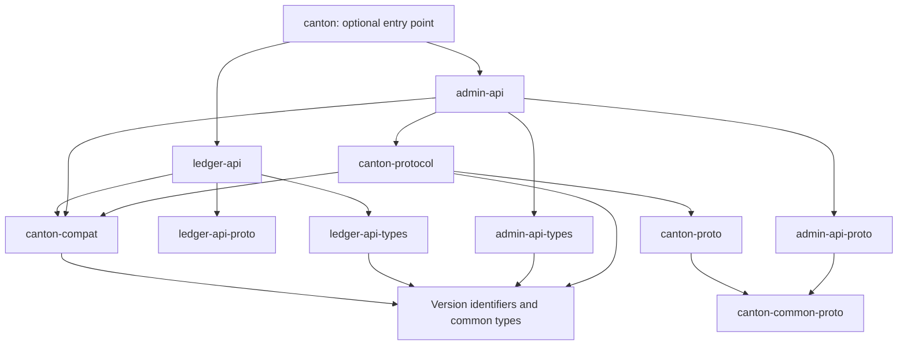

# How to organize the SDK code

Keep one repository and one main product workspace. Group crates by the work they do: Ledger API,
Admin API, Canton protocol, LF, and build tools. Keep the existing crate names during the first
changes so users do not have to rename dependencies just because a directory moved.

Add four crates for responsibilities that are currently missing or spread across API crates:

| Proposed crate | Responsibility |
| --- | --- |
| `canton-version` | Canton release, protocol, schema, and hashing identifiers. |
| `canton-compat` | Support records and checks; no network calls. |
| `canton-protocol` | Protocol models, codecs, topology, and validation. |
| `canton-common-proto` | Shared generated messages used by several raw crates. |

For example, a topology transaction is a protocol object even when fetched through Admin API. Its
decoding belongs in `canton-protocol`. The Admin client owns the RPC used to fetch it.

## Dependency direction

Arrows mean “depends on.” This diagram shows the main proposed dependencies:



Common types must not depend on clients or generated protobuf types. For example, an application
should be able to use `PackageId` without compiling tonic or the Admin API.

Each domain exports its own support records using types from `canton-compat`. The facade collects
records from enabled domains. `canton-compat` must not depend on `ledger-api` or `admin-api`,
because those clients already depend on it.

## Generated messages need one Rust owner

Two crates that independently generate the same protobuf message produce different Rust types. An
application cannot pass one to a function expecting the other, even when the bytes have the same
format.

Put shared Canton messages in `canton-common-proto` and generate `extern_path` mappings for other
crates. Keep Ledger value messages in their existing owner, `ledger-api-value-proto`.

Some topology Admin services currently live in `canton-proto`. Move their generated service clients
to `admin-api-proto`. Inspect the protobuf imports when making the split, so both crates depend on
common messages without depending on each other. Keep the upstream protobuf package names unchanged.

## Use versioned modules where interfaces differ

Expose explicit API paths such as `ledger_api::v2::Client`. A future v3 client can coexist with it.
Keep the current `grpc::v2` path as a migration re-export where possible.

Inside the client, separate RPC operations from wire conversion:

```text
ledger-api/src/
  v2/
    client.rs
    services/
  wire/v2/          # protobuf-to-model conversions
  discovery.rs      # read server version and feature information
  compatibility.rs  # declare support for individual operations
  transport/        # authentication, TLS, and retries

canton-protocol/src/
  context.rs        # physical synchronizer and actual protocol
  topology/transaction/
    model.rs
    codecs/schema30.rs
    codecs/table.rs
  crypto/
  serialization/    # wrappers and original bytes
  compatibility.rs
```

When one message gains a new schema, add a codec for that message. Do not copy every protocol type
into a new release directory. For example, a changed transaction encoding should not force a second
implementation of an unchanged `PartyId`.

Use one public model when versions have the same meaning. Use separate models when they do not.
Conversion must return an error if the target format cannot represent a field. For example, an
encoder must not drop a newly introduced authorization field to fit an older message.

Moving conversions out of the model crate has a Rust constraint: the client cannot implement
standard `TryFrom` between two types owned by dependency crates. Use adapter functions or an
SDK-owned conversion trait instead.

## Directory layout

The following groups make the repository easier to navigate. Moving directories is secondary to
fixing ownership and dependencies.

```text
crates/
  canton/           # facade
  core/             # types, version identifiers, compatibility checks, utilities
  protocol/         # shared schemas, protocol schemas, protocol implementation
  ledger/           # Ledger client, models, values, schemas, derives
  admin/            # Admin client, models, schemas
  lf/               # LF versions, archives, reader, codegen
  tooling/          # dpm-build and canton-paths
compatibility/
  declarations/     # support records reviewed with code changes
  upstream.lock     # exact schema sources and generation tools
  bundles/          # tested combinations of released crates
tools/xtask/        # schema import, generation, and report checks
tests/              # integration, compatibility, and upgrade tests
```

Keep derive crates beside the types they generate implementations for. Generated applications should
depend on runtime types and traits, not on the LF reader or generator.

## Cargo features include code; configuration selects behavior

For example, enabling two codec features should compile both codecs. The target protocol selects
which one to use. A dependency enabling another feature must not change an existing client's
selected format.

Avoid mutually exclusive features such as `canton-3-5` and `canton-3-6`. Cargo combines features
requested by dependencies. Use additive names such as `ledger-v2`, `admin-v30`, and `lf-v2` at the
facade level. [Cargo feature rules][s1]

Before 1.0, choose a normal Ledger-client default. Keep build tools, test helpers, and preview
support optional. Define `full` as all stable SDK components; preview code still needs explicit
runtime permission even if it was compiled transitively.

[Back to the overview][s2] · [Next: supported versions][s3]

[s1]: https://doc.rust-lang.org/cargo/reference/features.html
[s2]: README.md
[s3]: supported-versions.md
