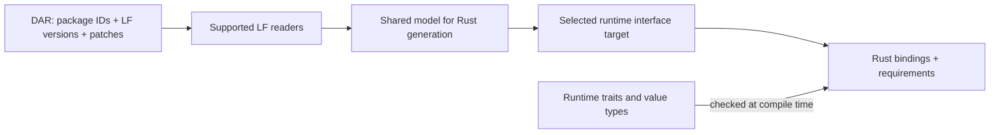

# LF versions, code generation, and package upgrades

Separate what the SDK can do with an LF package. Reading its header, decoding its data types,
generating Rust bindings, and validating executable code are different operations.

The current SDK checks some package structure, such as interned indexes. It does not perform the
participant engine's full language and type validation. See the [sealing implementation][s1].

## Keep the version of every package

Carry the LF language version, archive patch, and package ID through reading and generation. A DAR
can contain dependencies with different LF versions.

For example, a main package using LF 2.3 may depend on an LF 2.4 package. A generator supporting
only 2.3 cannot approve the DAR based on its main package alone. It must check each dependency
needed for the generated output and report the unsupported package ID.

Keep the existing `daml_lf::v2` organization. Share code for minor versions where their structures
agree, with checks for when each construct became available. Add separate readers only where the
format requires them. We do not need a copy of the entire crate for `2.1`, `2.2`, and `2.3`.

An inspection mode can retain unsupported bytes or tolerate a future archive patch, while reporting
an incomplete view. Binding generation must reject unknown structures that could affect the emitted
types. Never compute a new package ID by re-encoding a partially understood package.

Stable `2.4`, staging `2.4-rc1`, and `2.dev` need separate support entries. Preview reading or
generation requires explicit permission and fixtures from an exact source revision. Supporting LF1
inspection does not automatically mean supporting LF1 code generation.

## Generated Rust code depends on a runtime interface

The generator release and the runtime crate release are separate. Record the interface required by
generated code so the user can check whether their runtime crates implement it.

For example, a generator may emit bindings for interface revision 1 even after revision 2 is
available. This lets an application regenerate bindings without upgrading its runtime at the same
time.

Generated output should record:

- Generator version and interface revision.
- Accepted runtime crate versions and selected Ledger value/API generation.
- Input package IDs, names, metadata versions, LF versions, and archive patches.
- Compiler and input hashes when available.

Emit a reference to the required runtime interface marker so an incompatible runtime fails at
compile time. Keep this marker separate from ordinary crate SemVer.

The generator currently emits paths under `::canton`. Allow users to configure or resolve those
paths. For example, an application that renames its dependency to `canton_sdk` should still be able
to compile the bindings.

Keep generated applications dependent on runtime traits and types. They should not need the LF
reader or generator at runtime. Proc macros and codegen must agree on the emitted runtime interface.

Test generated output against the oldest and newest runtime versions in its declared range,
including a renamed-dependency example. A change to the default target or emitted public fields
needs a release note and an appropriate crate version bump.

## Keep package revision selection explicit

A package's metadata version is chosen by its author. Its package ID identifies its exact compiled
contents. Canton package versions use numeric segments; they are not the full SemVer grammar.

For example, `asset-model` revisions `1.4.0` and `1.5.0` can coexist in one Rust application. Keep
separate generated modules and exact IDs. The existing generator already uses package versions to
help distinguish module names.

An SDK upgrade must not automatically replace the application's chosen package with the highest
numbered revision. Package upload, vetting, and upgrade rules still decide what the participant
accepts. A higher apparent major number does not make an incompatible contract upgrade valid.
[Canton package upgrade rules][s2]

Generate old and new bindings side by side for a migration. Provide conversions only when the model
relationship is known. For example, moving data from an old record to a new record with an added
optional field can use an explicit conversion chosen by the application.

Record the compiler release, LF target, package metadata version, and generated Rust interface
separately. The compiler release does not need to exactly match the deployed Canton release.
[Compatible SDK guidance][s3]

[Back to the overview][s4] · [Next: releases and upgrades][s5]

[s1]: ../../daml-lf/src/v2/sealed/package.rs
[s2]: https://docs.canton.network/appdev/deep-dives/smart-contract-upgrading-reference
[s3]: https://docs.canton.network/global-synchronizer/understand/installing-daml-sdk
[s4]: README.md
[s5]: releases-and-upgrades.md
