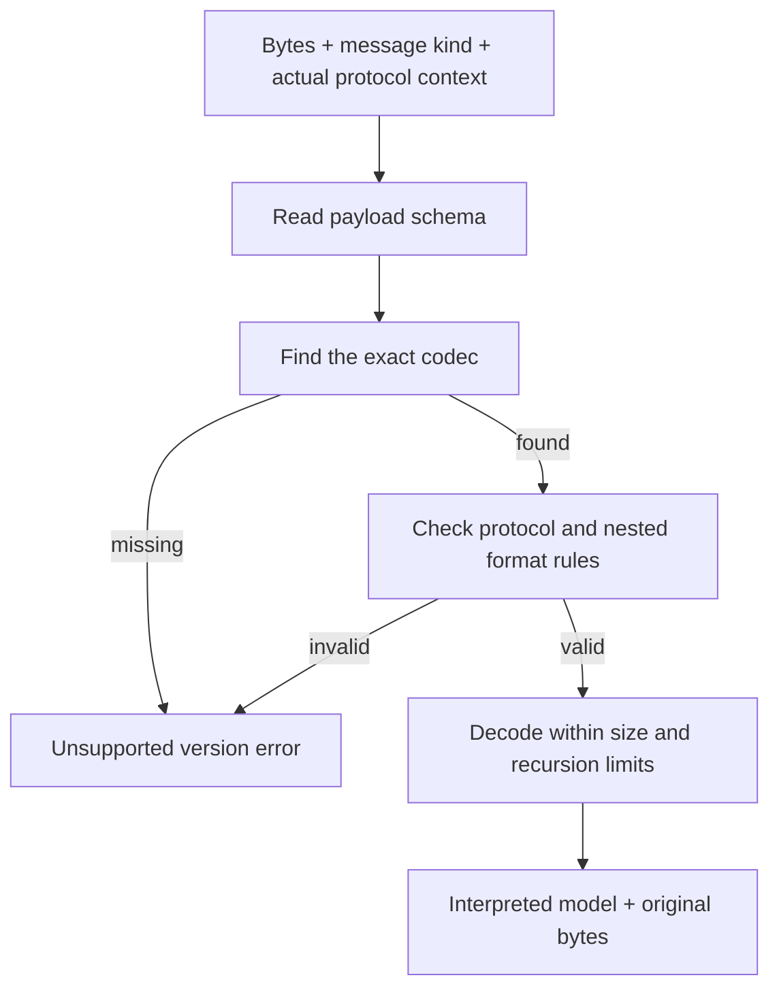

# Protocol messages and signed data

Put protocol encoding and decoding in `canton-protocol`. Each message kind owns a table of supported
schemas and allowed protocol contexts.

For example, topology transaction schema 30 is associated with protocol contexts beginning at 34 in
the inspected Canton code. Another message can use a different schema at the same protocol. Do not
choose one schema number for the whole SDK.

A codec is the code that turns a message into bytes or bytes into a message. Its support record
should distinguish reading from writing: we may keep a decoder for old snapshots after we stop
constructing new messages in that format.

## Decoding and encoding

For encoding, choose the codec required by the target protocol and check that the model fits that
schema. If a field cannot be represented, return an error. Do not drop the field and report success.

Unknown schema numbers must fail exact lookup. Trying the newest available decoder can interpret
future data incorrectly. An inspection tool may keep unknown bytes and display their schema number;
that does not permit executing or signing them.

Canton also uses a representative protocol version for a message: it marks a range that shares one
codec. This marker belongs to that message kind. Keep it separate from the actual operation
protocol, and do not reuse one message's representative to choose another message's codec.

## Keep original signed bytes

Decoding and re-encoding a protobuf message can change its bytes. The installed prost implementation
skips unknown message fields. It preserves unknown enum integers, but that is not enough to preserve
a complete signed message. See [Prost's documentation][s1].

For example, a signed topology transaction from a newer server may contain a field our model does
not know. If we decode it and serialize only the known fields, the signature may no longer apply.

Store the original bytes with the interpreted view and its checked schema/context. Forward an
unchanged signed object using those bytes. Editing the object invalidates that representation and
needs an implemented reconstruction and signing path.

Do not assume that ordinary prost serialization produces the exact encoding required by a
cryptographic specification. A signer must implement the particular hashing scheme, including its
metadata and serialization rules, and pass shared test vectors against Canton.

## Check the preparation response, not just cached server information

A prepared transaction determines which physical synchronizer, hashing scheme, and data formats the
signer must use. Keep that information and the returned preparation data together through signing
and execution.

If preparation reports scheme 4 but the SDK only implements scheme 3, fail before signing. The outer
API can still be Ledger API v2; that does not make the schemes interchangeable.

After a synchronizer upgrade, an old preparation may need to be discarded and prepared again. Do not
convert already signed bytes to a new format. New preparation and authorization must remain visible
to the application.

## Unknown API data also needs careful handling

Keep unknown enum values in read models where possible. An unknown protobuf `oneof` variant can
appear as a missing value. For a required event, treat that as unsupported or malformed rather than
silently dropping it.

For example, an update stream must not skip an event it cannot interpret and then advance the saved
offset past it. Report the error, or preserve the event through an explicitly designed raw-data
path.

Ordinary Ledger clients can keep contract IDs and continuation tokens opaque. Parsing a contract
authentication scheme is needed only for operations that verify it. Passing through an identifier
does not mean the SDK implements that scheme.

[Back to the overview][s2] · [Next: LF and generated bindings][s3]

[s1]: https://docs.rs/prost/0.14.3/prost/
[s2]: README.md
[s3]: lf-and-codegen.md
