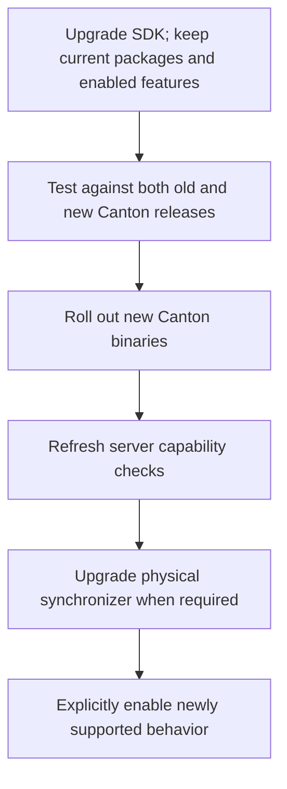

# Releasing crates and upgrading applications

Give each crate its own SemVer version. A crate version describes changes to its Rust API and
documented behavior. Use separate support records for the Canton releases and formats it works with.

For example, a hypothetical `ledger-api 1.4.0` could support commands on Canton 3.5 and 3.6. A fix
to that client could become `1.4.1` without any Canton upgrade.

## Choose version bumps by the user-visible change

| Change | Proposed release |
| --- | --- |
| Fix behavior to match the documented promise | Patch |
| Add a compatible operation or optional codec | Minor |
| Remove a public API or promised format support | Breaking release |
| Change an exposed dependency's type identity | Review as a possible breaking release |

For 1.x crates, a breaking release advances the major version. Before 1.0, advance the minor version
for breaking changes and document that policy. See [Cargo's compatibility guidance][s1].

Generated schemas need both wire and Rust API review. Adding a protobuf field may preserve wire
compatibility while breaking Rust callers that construct the generated struct with a literal. Adding
an enum variant can break exhaustive matches.

Keep evolving high-level models behind builders and private fields. Use `#[non_exhaustive]` where
users should not rely on a complete list of variants. Users who access raw generated types must
follow their crate's separate release history.

## Independent versions still need coordinated releases

Suppose a shared generated message changes incompatibly. Its owning crate needs a breaking release,
and every crate exposing that type needs review and possibly its own release. Their numbers do not
have to match, but their dependency requirements must agree.

Add registry version requirements alongside local paths. Publish dependencies before their
consumers. Keep the `canton` facade separately versioned because its re-exports are also public API.

Publish an immutable SDK bundle file listing exact tested crate versions, features, source revision,
minimum Rust version, and test results. Provide a reference application lockfile. The bundle records
a tested combination; normal Cargo version ranges may resolve a different compatible combination.

## Make published crates build on their own

Record schema sources and generation tools in `compatibility/upstream.lock`: commits, imported
files, content hashes, generator versions, and license information. Explain intentional mixed-source
inputs.

Prefer generating and checking in raw Rust bindings during SDK development. Consumers then do not
need protoc or sibling schema directories. Keep original schemas and descriptors for review and
regeneration through `xtask`.

If generation remains in `build.rs`, include every imported schema in the package and document the
required tools. In either case, test the packaged crate in an empty directory without workspace
files or build caches.

Use one accumulated schema for compatible changes within an API namespace. Retain old snapshots as
test inputs. If incompatible development snapshots reuse the same namespace, put them behind
explicit revision modules or separate preview crates.

## Upgrade one choice at a time

For example, first deploy a client tested with both old and new servers. During the server rollout,
use only operations supported by every backend. Once the rollout and capability checks pass, enable
the new operation.

Changing a physical synchronizer generation is separate from replacing binaries. Refresh its
protocol context. Package upgrades are another application choice and should use the package rules
described in [LF and codegen][s2]. See [Canton's synchronizer upgrade model][s3].

Already prepared and signed transactions cannot be rewritten for a new format. Reprepare and
authorize again where necessary. A rollback must first check whether the application has started
using features or stored data that the older SDK cannot handle. Server database rollback is outside
the client SDK's responsibilities.

Applications storing SDK-derived data should save an explicit application storage version and the
relevant format context. Do not promise that unversioned serde output or Rust struct layout is a
durable format.

## Publish when support ends

Start by maintaining the current and previous supported Canton minor lines, plus protocols still
needed during supported network upgrades. Publish the actual list; the policy alone does not
establish support for a release we have not reviewed and tested.

Announce removal at least one SDK minor release and 90 days ahead, with a longer period when network
migration needs it. Remove promised support in a breaking release. Give maintained older crate
majors a stated end date.

Reading old archives can remain supported after writing or signing their formats ends. Preview
support is pinned to an exact revision and may change between revisions. Promoting a preview format
to stable needs a fresh review.

Keep historical bundle files unchanged. Publish advisories separately for urgent exclusions, such as
an incompatible server patch. A future downloaded advisory service would need authentication and
explicit opt-in; the default support report should come from the installed artifact.

[Back to the overview][s4] · [Next: implementation plan][s5]

[s1]: https://doc.rust-lang.org/cargo/reference/semver.html
[s2]: lf-and-codegen.md
[s3]: https://docs.canton.network/global-synchronizer/production-operations/logical-synchronizer-upgrade
[s4]: README.md
[s5]: implementation-plan.md
