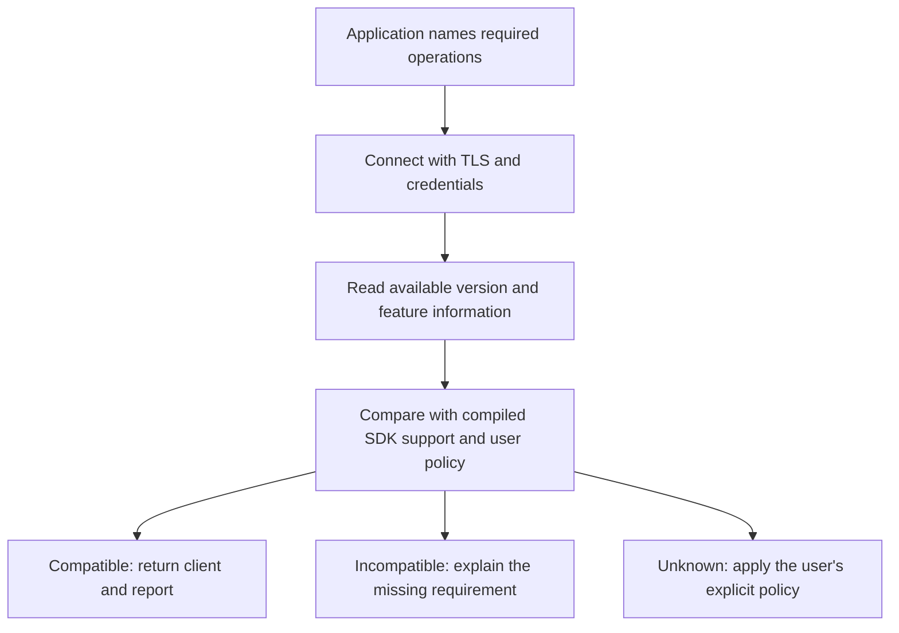

# Checking a server before using it

A client should check the operations its application requires. It should not reject a server just
because another, unused SDK feature is unavailable.

For example, a service that submits commands and streams updates needs those Ledger operations. It
does not need Admin credentials or an external transaction signer.

Add a checked connection method with this flow:

A lazy connection can defer these checks until first use. Its API must make it clear whether it has
only configured transport or has also checked the required operations.

## What discovery can tell us

The inspected Ledger version service returns the Canton build version and a partial feature
description. It does not return every supported LF version, synchronizer protocol, or signing
scheme. See the [Canton implementation][s1].

Keep the original version string and, when possible, a parsed release. A custom suffix should not
prevent the SDK from reporting the server's version.

Treat each observed feature as supported, unsupported, or unknown. For example, if a feature
descriptor is missing, report unknown unless the API specification defines a default. If a query
fails because of credentials, report missing evidence.

Some information requires Admin access or an operator-supplied setting. Record which source supplied
it. A statement from deployment configuration and a response from the server should be
distinguishable in the report. Basic Ledger operations should not require Admin access.

## Store protocol context per synchronizer

A participant can connect to synchronizer A on protocol 34 and synchronizer B on protocol 35. The
client must not store one protocol number and apply it to both.

Keep the logical synchronizer ID, physical generation, and actual protocol together. An operation
spanning two synchronizers, such as a reassignment, needs both contexts. An external preparation
response needs the context selected for that transaction.

Ordinary Ledger calls usually let Canton handle these details. Require the context only when the SDK
interprets or constructs data that depends on it.

## Let users choose how to handle unknown server support

| Policy | Behavior |
| --- | --- |
| Documented support | Require the operation to fall within the published support rules. |
| Best effort | Allow known ordinary API operations on an unassessed server, with a report. |
| Pinned preview | Allow explicitly requested preview formats at a pinned revision. |

No policy can substitute an unknown signing format with a known one. For example, a best-effort
client still cannot use a scheme-3 signer for a scheme-4 transaction.

## Refresh checks when the environment changes

Repeat discovery after reconnects, detectable server changes, or relevant capability failures.
Refresh protocol context when the physical synchronizer generation changes. Where the server has no
useful identity signal, expire cached observations after a bounded interval.

During a load-balanced rollout, one backend may support a method that another does not. Use only
features guaranteed on all backends, or route the operation to a backend whose capabilities are
known. Discovery from one backend does not establish support on the whole pool.

The server still decides whether an operation succeeds if configuration changes after discovery. If
a mutating RPC fails, do not automatically retry it using another API or message format. Preserve
the existing submission identifiers and retry rules. A read fallback is acceptable only when its
equivalent behavior is documented and allowed by the user.

[Back to the overview][s2] · [Next: protocol messages and signing][s3]

[s1]: ../../../canton/community/ledger/ledger-api-core/src/main/scala/com/digitalasset/canton/platform/apiserver/services/ApiVersionService.scala
[s2]: README.md
[s3]: protocol-and-signing.md
