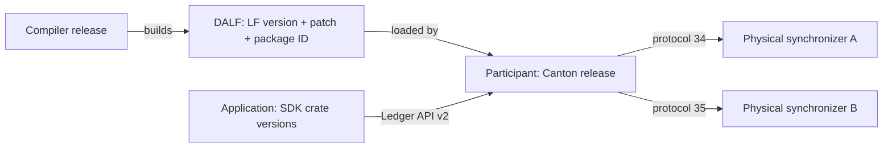

# Which versions the SDK should track

There is no single Canton version that answers every compatibility question. A participant can
expose Ledger API v2 while connecting to several synchronizers that use different protocols.

The SDK should track the following versions separately:

| Version | What it describes | Example |
| --- | --- | --- |
| Rust crate version | The crate's Rust API and documented behavior. | `ledger-api 1.4.0` |
| Canton release | The installed server implementation. | `3.5.19` |
| API generation | The interface an application calls. | Ledger API `v2`, Admin API `v30` |
| Canton protocol | The rules used on a physical synchronizer. | Protocol `35` |
| Message schema | The bytes for one kind of message. | Topology transaction schema `30` |
| LF language | The compiled language in a DALF package. | `2.3` |
| Archive patch | An extra format field in the LF archive payload. | Patch `0` |
| LF execution serialization | The format of transactions and execution data. | Serialization `V2` |
| Hashing scheme | How an externally authorized transaction is hashed. | Scheme `3` |
| Package revision | The author's revision. | `asset-model 1.4.0` |
| Package ID | The exact compiled package. | A content hash |
| Tool release | The compiler or DPM component. | A pinned release and digest |
| Generated interface revision | Runtime traits needed by generated code. | Proposed revision `1` |

The numbers in this table illustrate the different identifiers. The table does not claim that every
combination works.

This diagram shows where the main versions apply:

For example, an application submitting an ordinary Ledger command needs a working Ledger API client.
It usually does not need to choose a protocol codec. An application decoding a topology transaction
needs both its message schema and the protocol context in which that transaction is used.

## Several versions should coexist when users need them

| What can coexist? | How it should look |
| --- | --- |
| Several server releases | Separate clients and capability reports for each endpoint. |
| Several API generations | Explicit modules: `ledger_api::v2` and a future `ledger_api::v3`. |
| Several Canton protocols | A context per physical synchronizer. |
| Several message schemas | A decoder and encoder table per message kind. |
| Several LF versions | Check each package in a DAR, including dependencies. |
| Several package revisions | Separate generated modules, retaining exact package IDs. |
| Several hashing schemes | Separate implementations; use the actual preparation response. |

Do not require users to install different SDK crate versions just to talk to two supported Canton
releases. One crate release should include the required implementations where possible. Different
incompatible Rust crate versions may still coexist through Cargo, but their types are different and
may need explicit conversion.

## Use different Rust types for different version families

For example, `CantonProtocolVersion` and `MessageSchemaVersion<TopologyTransaction>` should be
different types even if both contain an integer. This prevents accidentally passing schema `30`
where protocol `35` is required.

Put Canton identifiers in the proposed `canton-version` crate. Keep LF identifiers in
`daml-lf-version`, and package revision types in `canton-types`. These crates should not need a
network client.

Parsing a version and supporting it are separate steps. We can preserve an unknown protocol number
in a report without having a codec for it. Likewise, protocol `36` does not prove that every smaller
protocol is supported: use an explicit set.

Treat `2.4-rc1`, stable `2.4`, and `2.dev` as different LF identities. Development support also
needs an exact source revision because the meaning of `dev` can change without its name changing.

Keep counters and opaque tokens out of this model. A physical synchronizer generation serial,
topology transaction serial, or pagination token is not a crate or format version. Store it using
the type needed by that operation.

[Back to the overview][s1] · [Next: code organization][s2]

[s1]: README.md
[s2]: code-organization.md
